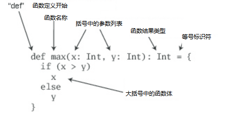
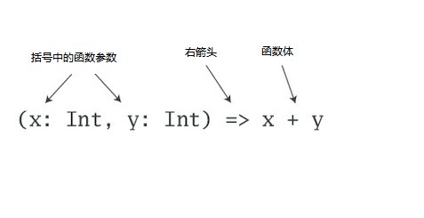

#Chapter 2 第二章

##First Steps in Scala  第一步

It's time to write some Scala code. Before we start on the in-depth Scala tutorial, we put in two chapters that will
 give the big picture of Scala, and most importantly, get you writing code. We encourage you to actually try out
 all the code examples presented in this chapter and the next as you go. The best way to start learning Scala is
 to program it.
 
 是时候写些Scala代码了。在我们深入介绍Scala之前，我们将用两章来整体介绍一下Scala，最重要的是，带你写代码。我们鼓励你亲自测试本章以及后续章节
 的代码示例。编码是学习Scala的最好方法。
 
 To run the examples in this chapter, you should have a standard Scala installation. To get one, go to 
 http://www.scala-lang.org/downloads and follow the directions for your platform. You can also use a Scala plugin-in
 for Eclipse, IntelliJ, or NetBeans. For the steps in this chapter, we'll assume you're using the Scala distribution 
 from [scala-lang.org](http://www.scala-lang.org) .[1]
 
 为了能够运行本章的例子，你应该先安装Scala的标准安装包。可以在http://www.scala-lang.org/downloads 网站下载安装包，根据自己的系统，选择安装向导。
你也可以使用Eclipse、IntelliJ、或者NetBeans的Scala插件。在本章节，我们假设你使用的是从[scala-lang.org](http://www.scala-lang.org)拿到的Scala发布包。

If you are a veteran programmer new to Scala, the next two chapters should give you enough understanding to enable you to start 
writing useful programs in Scala. If you are less experienced, some of the material may seem a bit mysterious to you. But don't 
worry. To get you up to speed quickly, we had to leave out some details. Everything will be explained in a less "fire hose" fashion
in later chapters. In addition, we inserted quite a few footnotes in these next two chapters to point you to later sections of the 
book where you will find more detailed explanations.


如果你是一个新接触Scala的具有编程经验的老鸟，下面两章可以让你具有开始使用Scala编码的能力。如果你没有经验，那么，对于你来说，有一些内容有些神秘了。但是不用担心，
为了让你更快上手，我们省略一些细节。所有的东西都会在后续章节作出解释。另外，我们在后面两章插入了一些脚注，以便在后面的章节找到更详细的解释。

### STEP 1. LEARN TO USE THE SCALA INTERPRETER   第一步：学习使用Scala解释器

The easiest way to get started with Scala is by using the Scala interpreter, an interactive "shell" for writing Scala expressions and programs.
The interpreter, which is called scala, will evaluate expressions you type and print the resulting value. You use it by typing scala at a command
prompt:[2]

开始学习Scala最简单的方法是使用Scala解释器，它是一个可交互的"shell"对于编写Scala表达式或者编程。这个解释器叫做：scala，它会计算你编写的表达式并打印出结果。你可以在命令控制台
编写scala使用它:

```
$ scala
Welcome to Scala 2.12.3 (Java HotSpot(TM) 64-Bit Server VM, Java 1.8.0_121).
Type in expressions for evaluation. Or try :help.

scala>
```
After you type an expression, such as 1 + 2, and hit enter: 之后，你输入一个表达式，例如 1 + 2，然后按回车：
```
scala> 1 + 2
```
The interpreter will print: 解释器将会打印出：
```
res0: Int = 3
```
This line includes:  这行包含以下信息：

-   an automatically generated or user-defined name to refer to the computed value (res0, which means results 0)  一个自动生成或者用户定义的名字，用来展示计算的结果(res0，它的结果是0)
-   a colon(:), followed by the type of the expression(Int)  冒号,以及在它后面的表达式类型：Int
-   an equals sign(=)   等号标识：=
-   the value resulting from evaluating the expression(3)  表达式的计算结果是:3

The type Int names the class Int in the package scala.Packages in Scala are similar to packages in Java: they partition the global namespace and 
provide a mechanism for information hiding[3]. Values of class Int correspond to Java's int values. More generally, all of Java's primitive types 
have corresponding classes in the scala package. For example, scala.Boolean corresponds to Java's boolean. scala.Float corresponds to Java's float.
And when you compile your Scala code to Java byte codes, the Scala compiler will use Java's primitive types where possible to give you the performance
benefits of the primitive types.


这个Int类型，也就是在scala.Packages包中的Int类，在Scala中，它与Java的包相似：他们都可以把全局空间分区，并提供了信息隐藏机制。Int类的值对应Java的int值。更普遍的，Java的所有原始
类型在scala包中都有对应的类。例如：scala.Boolean对应Java的boolean，scala.Float对应Java的float。并且，当你编译你的Scala代码为Java字节码时，Scala的编译器将会使用Java原始类型，
以便尽可能的从原始类型中获取更多的性能。

The resX identifier may be used in later lines. For instance, since res0 was set to 3 previously, res0 * 3 will be 9:

这个resX标识符可能会在以后的行中使用。比如：当上面提到的res0被赋值为3，res0 * 3 将会得到9。
```
scala> res0 * 3
res1: Int = 9
```
To print the necessary, but not sufficient, Hello, world! greeting, type:   为了打印的需要，也不是十分的充足，输入一个打招呼的：Hello, world!:
```
scala> println("Hello, world!")
Hello, world
```
The println function prints the passed string to the standard output, similar to System.out.println in Java.

这个println方法打印传递的字符串到标准输出，就行Java里面的System.out.println。

### STEP 2. DEFINE SOME VARIABLES   第二步，定义一些变量

Scala has two kinds of variables, vals and vars. A val is similar to a final variable in Java. Once initialized, a val can never be reassigned.
A var, by contrast, is similar to a non-final variable in Java. A var can be reassigned throughout its lifetime. Here's a val definition:

Scala有两种类型的变量，vals和vars。这个val就行是Java里面的final变量。一旦初始化，这个val就不能被重新赋值。这个var，作为对比，就像是Java里面的非final变量。在它的生命周期中，
可以被重新的赋值。这里是val变量的定义：
```
scala> val msg = "Hello, world!"
msg: String = Hello, world!
```
This statement introduces msg as a name for the string "Hello, world!". The type of msg is java.lang.String, because Scala strings are implemented
by Java's String class.

这个声明说明msg作为一个字符串“Hello, world!”的名字。这个msg的类型是java.lang.String,因为Scala的字符串是用Java的String类实现的。

If you're used to declaring variables in Java, you'll notice one striking difference here: neither java.lang.String nor String appear anywhere in the
val definition. This example illustrates _type interface_, Scala's ability to figure out types you leave off. In this case, because you initialized
msg with a string literal, Scala inferred the type of msg to be String. When the Scala interpreter(or compiler) can infer types, it is often best to
let it do so rather than fill the code with unnecessary, explicit type annotations. You can, however, specify a type if you wish, and sometimes you 
probably should. An explicit type annotation can both ensure the Scala compiler infers the type you intend, as well as serve as useful documentation
for future readers of the code. In contrast to Java, where you specify a variable's type before its name, in Scala you specify a variable's type after
its name, separated by a colon. For example:

如果你之前用Java声明过变量，你将会注意到一个显著的不同的地方：在使用val定义的地方，没有java.lang.String或者String出现。这个例子说明 _"类型推导"(type interface)_, Scala
具有想象出你省略类型的能力。这里，因为你用字符串字变量初始化了一个msg，Scala推导出这个msg的类型是String。 当Scala的解释器(或者编译器)能推导类型，省略类型将比那些填充一些不必要的
的明确类型注释的代码要好很多。 你可以，如果你愿意定义一个类型，很多时候，你应该这样做。一个明确的类型注释，既可以确保Scala编译器推导出你想要的类型，也可以对将来的读这些代码的人
有很大帮助。对比Java， 你要在变量的前面定义它的类型，而在Scala中，变量的类型在它的名字之后，用冒号作为分隔。比如：

```
scala> val msg2: java.lang.String = "Hello again, world!"
msgs: String = Hello again, world!
```
Or, since java.lang types are visible with their simple names[4] in Scala programs, simply:

或者，因为在Scala程序里，java.lang类型的简化名是可见的，简写为：
```
scala> val msg3: String = "Hello yet again, world!"
msg3: String = Hello yet again, world!
```
Going back to the original msg, now that it is defined, you can use it as you'd expect, for example:

回到这个原来的msg，现在它被定义了，你可以随意使用它，如：
```
scala> println(msg)
Hello, world!
```
What you can't do with msg, give that it is a val, not a var, is reassign it[5]. For example, see how the interpreter complains when you attempt the
following:

什么是不能用msg做的，msg是一个val变量，而不是var，所有不能被重新赋值。例如，如果你尝试使用以下代码修改msg，看一下解释器怎么报错：
```
scala> msg = "Goodbye, cruel world!"
<console>:12: error: reassignment to val
       msg = "Goodbye, cruel world!"
           ^
```
If reassignment is what you want,you'll need to use a var, as in:

如果你想重新赋值，那么你应该使用var，像下面：
````
scala> var greeting = "Hello, world!"
greeting: String = Hello,world!
```` 
Since greeting is a var not a val, you can reassign it later. If you are feeling grouchy later, for example, you could change your greeting to:

因为greeting是一个var而不是val，所以，你可以在以后对它重新赋值。如果你在后面感觉它不好，比如，你可以更改你的greeting：
```
scala> greeting = "Leave me alone, world!"
greeting: String = Leave me alone, world!
```
To enter something into the interpreter that spans multiple lines, just keep typing after the first line. If the code you typed so far is not complete
, the interpreter will respond with a vertical bar on the next line.

为了输入一个跨多行的东西到解释器中，仅仅在第一行后继续编写即可。如果你编写的代码到行尾还没有完成，解释器将会在下一行使用竖线作为回应。
```
scala> val multiLine =
     |   "This is the next line."
multiLine: String = This is the next line.
```
If you realize you have typed something wrong, but the interpreter is still waiting for more input, you can escape by pressing enter twice:

如果你注意到有些你编写错误，但是解释器仍在等待更多的输入，你可以按两次enter键离开。
```
scala> val oops =
       | 
       | 
  You typed two blank lines.  Starting a new command.
  
  scala>
```
In the rest of the book, we'll leave out the vertical bars to make the code easier to read(and easier to copy and paste from the PDF eBook into the interpreter).

在本书的剩余部分，我们将省略掉竖线使代码易读（更容易的从PDF电子书复制粘贴到解释器中）。

###STEP 3. DEFINE SOME FUNCTIONS    第三步，定义一些函数

Now that you've worked with Scala variables, you'll probably want to write some functions. Here's how you do that in Scala:

现在，你已经会使用Scala变量了，你或许想要写一些函数。像这样一样：
```
scala> def max(x: Int, y: Int): Int = {
         if (x > y) x
         else y
       }
max: (x: Int, y: Int)Int
```
Functions definitions start with def. The function's name, in this case max, is followed by a comma separated list of parameters in parentheses.
A type annotation must follow every function parameter, preceded by a colon, because the Scala compiler (and interpreter, but from now on we'll just
say compiler) does not infer function parameter types. In this example, the function named max takes two parameters, x and y, both of type Int. After
the close parenthesis of max's parameter list you'll find another ":Int" type annotation. This one defines the _result type_ of the max function itself.
[6] Following the function's result type is an equals sign and pair of curly braces that contain the body of the function. In this case, the body contains
a single if expression, which selects either x or y, whichever is greater, as the result of the max function. As demonstrated here, Scala's if expression
can result in a value, similar to Java's ternary operator. For example, the Scala expression "if(x>y)x else y" behaves similarly to "(x>y)?x:y" in Java
. The equals sign that precedes the body of a function hints that in the functional world view, a function defines an expression that results in a value.
The basic structure of a function is illustrated in Figure 2.1.

函数使用def开始。函数的名称，这个例子中的max，其后的圆括号中，是一组以逗号分隔的参数列表。使用冒号作为前缀的类型标注必须在函数参数的后面。在这个例子中，函数的名字是max，有两个参数
x和y，它们的类型都是Int。在函数max的参数列表的闭圆括号后，你将会发现另一个 ":Int" 类型注释。这个是定义了max函数的 _结果类型_ 。跟在函数结果类型的后面是一个等号，和一对包含
函数体的大括号。这里，函数体包含了一个if表达式，这个选择x或者y的最大者，最为max的结果。正如我们所看，Scala的if表达式就像Java中的三元表达式一样生成结果。例如，这个Scala的表达式
"if(x>y)x else y" 就像Java的"(x>y)?x:y"。这个函数体前的等号符号提示我们，在函数式的世界里，函数定义是一个可以产生值的表达式。图2.1可以说明函数的基础结构。


**Figure 2.1-The basic form of a function definition in Scala.图2.1-Scala函数定义的基础组成**

Sometimes the Scala compiler will require you to specify the result type of a function. If the function is _recursive_ [7], for example, you must explicitly
specify the function's result type. In the case of max, however, you may leave the result type off and the compiler infer it.[8] Also, if a function consists
of just one statement, you can optionally leave off the curly braces. Thus, you could alternatively write the max function like this:

有时候Scala的编译器会要求你定义函数的结果类型。例如，你必须明确指出递归函数的函数返回值。相反，在max例子中，你可以省去结果类型，并且编译器可以推导出它。同时，如果一个方法仅仅由一段组成，
你可以选择省略大括号。因此，你可以选择像这样写max函数：
```
scala> def max(x: Int, y: Int) = if (x > y) x else y
max: (x: Int, y: Int)Int
```
Once you defined a function, you can call it by name, as in:

一旦你定义了一个函数，你可以通过名字调用他，像这样：
```
scala> max(3, 5)
res4: Int = 5
```
Here's the definition of a function that takes no parameters and returns no interesting result:

这里是一个函数的定义，它没有参数和没有返回值：
```
scala> def greet() = println("Hello, world!")
greet: ()Unit
```
When you define the greet() function, the interpreter will respond with greet: ()Unit. "greet" is, of course, the name of function. The empty parentheses
indicate the function takes no parameters. And Unit is greet's result type. A result type of Unit indicates the function returns no interesting value.
Scala's Unit type is similar to Java's void type; in fact, every void-returning method in Java is mapped to a Unit-returning method in Scala. Methods with
the result type of Unit, therefore, are only executed for their side effects. In the case of greet(), the side effect is a friendly greeting printed to 
the standard output.

当你定义一个greet()函数，这个解释器会回应一个greet: ()Unit。当然，greet是函数的名称。空的括号表明这个函数没有参数。且Unit是greet的结果类型。Unit的结果类型表明，这个函数没有返回值。
Scala的Unit类型就像是Java中的void类型。实际上，Java中的每个空返回值(void-returning)都是对应到Scala中的Unit返回值(Unit-returning)。方法的返回值是Unit，因此，执行它仅仅是为了
它的副作用(side effect)。greet例子，它的副作用是友好的问候被输出到标准输出中。

In the next step, you'll place Scala code in a file and run it as a script. If you wish to exit the interpreter, you can do so by entering :quit or :q.

接下来，你将会在文件中写Scala代码，并作为脚本运行它。如果你想退出解释器，你可以输入:quit或者:q。
```
scala> :quit
$
```  

STEP 4. WRITE SOME SCALA SCRIPTS   第四步， 写Scala脚本

Although Scala is designed to help programmers build very large-scale system, it also scales down nicely to scripting. A script is just a sequence of 
statements in a file that will be executed sequentially. Put this into a file named hello.scala:
尽管Scala的设计是为了帮助程序员构建大的可伸缩的系统，它也可以很好的适应脚本。一个脚本是一个连续的段在一个文件中，会被顺序执行。把这些放到名字为hello.scala的文件中：
```scala
println("Hello, world, from a script!")
```
then run:[9] 然后运行
```
$ scala hello.scala
```
And you should get ye anther greeting:   你会得到另外一个问候：

`Hello, world, from a script`

Command line arguments to a Scala script are available via a Scala array named args. In Scala, arrays are zero based, and you access an element by specifying
an index in parentheses. So the first element in a Scala array named steps is step(0), not steps\[0\], as in Java. To try this out, type the following into
a new file named helloarg.scala:
Scala脚本的命令行参数可以通过名叫args的Scala数组获取。在Scala中，数组从0开始，可以在圆括号中指定一个下标来获取元素。所以Scala的steps数组的第一个元素是steps(0)，而不是Java中的steps\[0\]。
为了验证这个，把下面的输入到helloarg.scala的新文件中：
```scala
// Say hello to the first argument
println("Hello, " + args(0) + "!")
```
then run: 运行:

```
$ scala heloarg.scala planet
```
In this command, "planet" is passed as a command line argument, which is accessed in the script as args(0). Thus you should see:

这个命令，“planet” 作为命令行参数被传递，在脚本里使用args(0)获取值。因此你会看到：

`Hello planet!`

Note that this script included a comment. The scala compiler will ignore characters between // and the next end of line and any characters between /* and */
This example also shows Strings being concatenated with the + operator. The works as you'd expect. The expression "Hello, " + "world!" will result in the
string "Hello, world!".

注意这个脚本包含了一个注释。Scala的编译器会忽略在//到行尾的字符和在/* 与 */ 之间的字符。这个例子也展示了使用+操作符把字符串连接起来。正如你期望的那样运行。这个表达式： "Hello, " + "world!"
将会生成 "Hello, world!" 字符串。

STEP 5. LOOP WITH WHILE; DECIDE WITH IF   While循环，If判断

To try out a while, type the following into a file named printargs.scala

```scala
var i = 0
while (i < args.length) {
  println(args(i))
  i += 1
}
```
#####Note
Although the examples in this section help explain while loops, they do not demonstrate the best Scala style. In the next section, you'll see better
approaches that avoid iterating through arrays with indexes.

尽管本段的这个例子帮助解释了while循环，他们不能证明这是最好的Scala风格。在下一段，你将会看到好的方法，避免使用下标遍历数组。

This script starts with a variable definition, var i = 0. Type inference gives i the type scala.Int, because that is the type of its initial value, 0.
The while construct on the next line causes the block (the code between the curly braces) to repeatedly executed until the boolean expression i < 
args.length is false. args.length gives the length of the args array. The block contains two statements, each indented two spaces, the recommended
indentation style for Scala. The first statement, println(args(i)) prints out the ith command line argument. The second statement, i+=1, increments
i by one. Note that Java's ++ i and i++ don't work in Scala. To increment in Scala, you need to say either i = i + 1 or i += 1. Run this script with
the following command:

这个脚本以一个变量定义开始，var i = 0. 类型推断出i的类型是scala.Int，因为给它的初始值是0。 下一行的while结构导致这个语句块(大括号中的代码)被重复执行直到boolean表达式i<
args.length返回false。args.length提供args数组的长度。这语句块包含两个声明，每一行都会缩进两个空格，这是Scala推荐的缩进风格。第一个声明，println(args(i)) 打印第i个命令
行参数。第二个声明，i += 1，对i加一。注意，Java中的 ++i 与 i++ 不能用在Scala中。在Scala中加一，你需要用 i = i + 1或者 i += 1。使用下面命令运行这个脚本：
```
$ scala printargs.scala Scala is fun
``` 
And you should see:   你将会看到：
```
Scala
is
fun
```
For even more fun, type the following code into a new file with the name echoargs.scala:

更加有趣的是，输入一下的代码到一个名称为echoargs.scala的新文件中:

```scala
var i = 0
while (i < args.length) {
  if (i != 0) 
    print(" ")
  print(args(i))
  i += 1
}
println()
```
In this version, you've replaced the println call with a print call, so that all the arguments will be printed out on the same line. To make this
readable, you've inserted a single space before each argument expect the first var the if (i != 0) construct. Since i != 0 will be false the first 
time through the while loop, no space will get printed before initial argument. Lastly, you've added one more println to the end, to get a line 
return after printing out all the arguments. Your output will be very pretty indeed. If you run this script with the following command:

这个版本，你已经使用print调用替换println调用，所以，所有的参数都会在同一行输出。为了可读性，你已经在每个参数前面插入了一个空格，通过if (i != 0)除去了第一个参数。因为在第一次
经过while循环，i != 0 将会返回false， 没有空格在初始参数前输出。最后，在末尾添加了一个println，在所有参数输出后获取新的一行。你的输出将会非常好。如果你使用下面命令运行它：
```
$ scala echoargs.scala Scala is even more fun
```
You will get: 你会看到：
```
Scala is even more fun

```
Note that in Scala, as in Java, you must put the boolean expression for a while or an if in parentheses.(In other words, you can't say in Scala things
like if i < 10 as you can in a language such as Ruby. You must be say if (i < 10) in Scala.) Another similarity to Java is that if a block has only 
one statement, you can optionally leave off the curly braces, as demonstrated by the if statement in echoargs.scala. And although you haven't seen 
any of them, Scala does use semicolons to separate statements as in Java, except that in Scala the semicolons are very often optional, giving some
welcome relief to your right little finger. If you had been in a more verbose mood, therefore, you could have written the echoargs.scala script as
follows:

注意，在Scala中，就像Java一样，你必须把while的布尔表达式放到括号中。(换句话说，在Scala中，你不能像Ruby语言那样使用if i < 10，你必须使用if(i < 10)。)另一个与Java类似的地方
是，if语句块只有一句，你可选择省略大括号，在echoargs.scala中已经被证明了。尽管你没有看见任何的分号，但是Scala跟Java一样也是用分号分隔语句的，因为在Scala中分号是可选的，这给你
的右小拇指以安慰。如果你心情比较复杂，因此，你可以像一下一样写入到echoargs.scala中：
```scala
var i = 0;
while (i < args.length) {
  if (i != 0) {
    print(" ");
  }
  print(args(i));
}
println();
```
###STEP 6. ITERATE WITH FOREACH AND FOR  使用Foreach和For遍历
  
Although you may not have realized it, when you wrote the while loops in the previous step, you were programming in an _imperative_ style. In the
imperative style, which is the style you normally use with languages like Java, C++ and C, you give one imperative command at a time, iterate with
loops, and often mutate state shared between different functions. Scala enables you to program imperatively, but as you get to know Scala better,
you'll likely often find yourself programming in a more _functional_ style. In fact, one of the main aims of this book is to help you become as
comfortable with the functional style as you are with imperative style.

尽管你也行还没有实现过它，当你在之前的步骤写while循环，你使用的是 _命令式_ 风格。在命令式风格中，你可以Java、C++、C中正常的使用，你同一时间给出命令，循环遍历，经常在不同的
函数中共享可变状态。Scala也提供了命令式编程风格，但是，为了让你更好的理解Scala，你可能会发现你自己使用 _函数式_ 编程风格。实际上，这本书的目的之一就是帮助你适应函数式编程风格
就像你使用命令式风格一样。

One of the main characteristics of a functional language is that functions are first class constructs, and that's very true in Scala. For example,
another (far more concise) way to print each command line argument is:

函数式编程语言的一个主要特点是，函数是一等公民，在Scala中是真的。例如，另外(更加简洁的)的答应命令行参数的方法：

`args.foreach(arg => println(arg))`  

In this code, you call the foreach method on args and pass in a function. In this case, you're passing in a _function literal_ that takes one parameter
named arg. The body of the function is println(arg). If you type the above code into a new file named pa.scala and execute with the command:

这段代码，你在args上调用foreach方法，并传递一个函数。本例中，你传递了一个 _函数显示声明(function literal)_ 并且带有一个arg的参数。这个函数体是 println(arg)。如果你在
pa.scala的新文件中编写了以上代码并以下面的命令执行了它，

```
$ scala pa.scala Concise is nice
```
You should see:   你将会看到
```
Concise
is
nice
```
In the previous example, the Scala interpreter infers the type of arg to be String, since String is the element type of the array on which you're 
calling foreach. If you'd prefer to be more explicit, you can mention the type name. But when you do, you'll need to wrap the argument portion in
parentheses (which is the normal form of the syntax anyway):

这之前的例子，Scala的解释器推断出arg的类型是String。所以，调用foreach时，数组元素类型是String。如果你想更加明确，你可以提供类型名称。但是当你那样做，你需要在括号中封装
参数(这是任意语法的基本组成)

```scala
args.foreach((arg: String) => println(arg))
``` 
Running this script has the same behavior as the previous one.

运行的结果与前一个相同。

If you're in the mood for more conciseness instead of more explicitness, you can take advantage of a special shorthand in Scala. If a function literal
consists of one statement that takes a single argument, you need not explicitly name and specify the argument[10]. Thus, the following code also works:

如果你喜欢用简介替代明确，你可以使用更高级的速写方法。如果一个方法由一段持有单个参数组成，你不需要明确指出名字和定义参数。因此，下面的代码一样可以打印出参数：

`args.foreach(println)`

To summarize, the syntax for a function literal is a list of named parameters, in parentheses, a right arrow, and then the body of the function. This
syntax is illustrated in Figure 2.2.

总结一下，函数显式声明语法是：一组参数名称，括号，右箭头，函数体。图2.2解释了这个语法。



Now, by this point you may be wondering what happened to those trusty for loops you haven been accustomed to using in imperative languages, such as 
Java and C. In an effort to guide you in a functional direction, only a functional relative of the imperative for (called a _for expression_) is
available in Scala.While you won't see their full power and expressiveness until you reach (or peek ahead to) Section 7.3, we'll give you a glimpse
here. In a new file named forargs.scala, type the following:

现在，通过这一点，你可能想知道那些命令式语言如Java和C里常用的for循环发生了什么。为了努力引导你使用函数式编程，Scala中只有一个相对于指令式for(叫做 for表达式)的函数是可用的。
在7.3章节，将会详细讲解它们的完整功能和表现，这里会讲一点。创建一个forargs.scala文件，输入一下代码：

`for (arg <- args) println(arg)`

The parentheses after the "for" contain arg <- args.[11] To the right <- symbol is the familiar args array. The the left of <- is "arg", the name of a val,
not a var(Because it is always a val, you just write "arg" by itself, not "val arg"). Although arg may seem to be a var, because it will get a new
value on each iteration, it really is a val: arg can't be reassigned inside the body of the for expression. Instead, for each element of the args 
array, a new arg val will be created and initialized to the element value, and the body of the for will be executed.

for后面的括号中包含了一个arg <- args。 <-符号右边的是熟悉的args数组。<-的左边是arg，它是一个val而不是var变量(因为它总是val，所有只需要写arg即可，不用写"val arg")。尽管arg
可能看起来像是一个var，因为它每次遍历都会有一个新值，但是它确实是一个var: arg不能再for表达式内部再被赋值。相应的，for遍历args的每一个元素，都会创建一个新的arg，并且使用元素初始化。
然后for的代码块将会被执行。

If you run the forargs.scala script with the command:

如果，你使用这个命令运行forargs.scala脚本：

```
$ scala forargs.scala for arg in args
```

you will see:     你将会看到：
```
for
arg
in
args
```

Scala's for expression can do much more than this, but this example is enough to get you started. We'll show you more about for in Section 7.3 and 
Chapter 23.

Scala的for表达式可以做更多的事情，但是这个例子足以让你使用它了。我们将要在第7.3章节和23章更深入的讲解。


