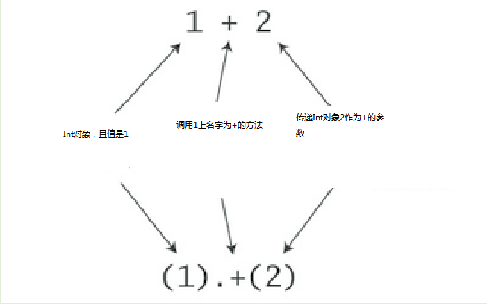

#Chapter 3    第三章

## Next Steps in Scala    进一步使用Scala

This chapter continues the previous chapter's introduction to Scala. In this chapter, we will introduce some more advanced features. When you complete
this chapter, you should have enough knowledge to enable you to start writing useful scripts in Scala. As with the previous chapter, we recommend you
try out these examples as you go. The best way to get a feel for Scala is to start writing Scala code.

这章将继续之前的章节介绍Scala。这章中，我们将会介绍一些更高级特性。当你完成此章节的阅读，你将会更好的使用Scala写更有用的脚本。跟之前的章节一样，我们建议你像之前那样完成所有的例子。
获取Scala编码风格的最好办法就是编写Scala代码。

###Step 7. PARAMETERIZE ARRAYS WITH TYPES  使用类型参数化数组

In Scala, you can instantiate objects, or class instances, using new. When you instantiate an object in Scala, you can _parameterize_ it with values
and types. Parameterization means "configuring" an instance when you create it. You parameterize an instance with values by passing objects to a 
constructor in parentheses. For example, the following Scala code instantiates a new java.math.BigInteger and parameterizes it with the value "12345":

在Scala中，你可以使用new实例化一个对象，或者是一个类实例。当你使用Scala实例化一个对象，你可以使用值和类型 _参数化_ 它。参数化的意思是可以配置你创建的实例。通过使用对象的构造函数
来给实例传递参数化的值。例如：下面的Scala代码实例化了一个 new java.math.BigInteger 并且使用“12345”参数化它。

```scala
val big = new java.math.BigInteger("12345")
```

You parameterize an instance with types by specifying one or more types in square brackets. An example is show in Listing 3.1. In this example, greetStrings
is a value of type Array[String] (an "array of string") that is initialized to length 3 by parameterizing it with the value 3 in the first line of code.
If you run the code in Listing 3.1 as a script, you'll see yet another Hello, world! greeting. Note that when you parameterize an instance with both 
a type and a value, the type comes first in its square brackets, followed by the value in parentheses.

你使用在中括号中指定了一个或多个类型来参数化一个实例。例如清单3.1的例子。在这个例子中，greetStrings是一个Array[String]的类型(一个"字符串数组")，通过参数化的值3来初始化数组长度。
如果你把清单3.1作为脚本运行，你将也会看到另外一个问候语：Hello, world! 注意，当你使用一个类型和一个值来参数化一个实例，首先类型将在中括号中，然后才是值在括号中。
```scala
    val greetStrings = new Array[String](3) 
    greetStrings(0) = "Hello"
    greetStrings(1) = ", "
    greetStrings(2) = "world!\n"
    for (i<- 0 to 2) print(greetStrings(i))
```
**Listing 3.1-Parameterizing an array with a type.   清单3.1-使用类型参数化一个数组**

**Note  注意**

Although the code in Listing 3.1 demonstrates important concepts, it does not show the recommended way to create and initialize an array in Scala. You'll
see a better way in Listing 3.2 here.

尽管清单3.1证明了重要的概念，但是在Scala中，它不是推荐的创建和初始化数组的方法。你将会在3.2中看到更好的方式。

Had you been in a more explict mood, you could have specified the type of greetStrings explicitly like this:

你应该能够明白，你可以定义greetStrings明确的类型，像下面那样:

```scala
val greetStrings: Array[String] = new Array[String](3)
```

Given Scala's type interface, this line of code is semantically equivalent to the actual first line of Listing 3.1. But this form demonstrates that
while the type parameterization portion (the type names in square brackets) forms part of the type of the instance, the value parameterization part
(the values in parentheses) does not. The type of greetStrings is Array[String], not Array\[String\](3).

给出的Scala类型接口，这行的代码在语义上与清单3.1的第一行等价。但是，类型参数化的一部分(在中括号中的名字)，这种形式，证明了是实例的组成部分。值的参数化部分不是(在括号中的值)。
所以，greetStrings的类型是Array\[String\],并不是Array\[String\](3)

The next three lines of code in Listing 3.1 initialize each element of the greetStrings array:

下面的这3行代码初始化了greetStrings数组：

```scala
    greetStrings(0) = "Hello"
    greetStrings(1) = ", "
    greetStrings(2) = "world!\n"
```

As mentioned previously, arrays in Scala are accessed by placing the index inside parentheses, not square brackets as in Java. Thus the zeroth element
of the array is greetStrings(0), not greetStrings\[0\].

就像前面提到的，在Scala中，数组可以使用在括号中的索引来访问，不是Java中的中括号。因此，greetStrings的第0个元素是greetStrings(0)，而不是greetStrings\[0\]。

These three lines of code illustrate an important concept to understand about Scala concerting the meaning of val. When you define a variable with val,
the variable can't be reassigned, but the object to which it refers could potentially still be changed. So in this case, you could not reassign greetStrings
to a different array; greetStrings will always point to the same Array\[String\] instance with which it was initialized. But you can change the elements
of that Array\[String\] over time, so the array itself is mutable.

这三行代码说明了一个重要的概念，对于配合理解Scala val的意义。当你使用val定义一个变量，这个变量不能被重新赋值，但是，它关联的对象内仍然可以改变。所以在这个例子中，你不能重新赋值
greetStrings为另外一个数组；greetStrings仍然会指定到与初始化值同样的Array\[String\]实例。但是，在任何时间，你都可以改变它的元素，所以数组自己是可变的。

The final two lines in Listing 3.1 contain a for expression that prints out each greetStrings array element in turn:

在清单3.1中的最后两行代码的for表达式，打印出greetStrings数组的每个元素。

```scala
for(i <- 0 to 2) 
  print(greetStrings(i))
```  

The first line of code in this for expression illustrates another general rule of Scala: if a method takes only one parameter, you can call it without
a dot or parentheses. The to in this example is actually a method that takes one Int argument. The code 0 to 2 is transformed into the method call
(0).to(2). Note that this syntax only works if you explicitly specify the receiver of the method call. You can't write "println 10", but you can 
write "Console println 10".

第一行的代码辨明了Scala的另外一个规则，如果一个方法拥有一个参数，你调用它是，可以不用“.”或者括号。这个例子事实上就是只有一个Int的参数。代码 0 to 2 被转换成叫做(0).to(2)的方法。
注意，这种语法仅仅在你明确定义了方法调用的接收者才有效。你不能写"println 10"，但是你可以写成"Console println 10"。

Scala does not technically have operator overloading, because it doesn't actually have operators in the traditional sense. Instead, characters such as
+, -, *, and / can be used in method names. Thus, when you types 1+2 into the Scala interpreter in Step 1, you were actually invoking a method named
\+ on the Int object 1, passing in 2 as a parameter. As illustrated in Figure 3.1, you could alternatively have written 1 + 2 using traditional method
invocation syntax, (1).+(2)

Scala在技术上没有操作符重载，因为它并不是传统意义上的操作符。 相反，像 +,-,*,/可以被用作方法的名称。因此，当你在第一步中在Scala解释器中输入1 + 2时，你实际上是调用了一个在Int
对象1上方法，它的名字是+，传入2作为参数。 图3.1说明，你可以使用传统的方法调用语法(1).+(2)来写1 + 2，



**Figure 3.1- All operations are method calls in Scala   在Scala中所有的操作都称为方法调用**

Another important idea illustrated by this example will give you insight into why arrays are accessed with parentheses in Scala. Scala has fewer 
special cases than Java. Arrays are simply instances of classes like any other class in Scala. When you apply parentheses surrounding one or more
values to a variable, Scala will transform the code into an invocation of a method named apply on that variable. So greetStrings(i) get transformed
into greetStrings.apply(i). Thus accessing an element of an array in Scala is simply a method call like any other. This principle is not restricted
to arrays: any application of an object to some arguments in parentheses will be transformed to an apply method call. Of course, this will compile
only if that type of object actually defines an apply method. So it's not a special case; it's a general rule.

这个例子，解释了另外一个重要的思想，带你理解为什么访问数组是使用括号。Scala比Java少了一些特殊情况。在Scala中，Arrays就像其它类一样，是简单的类实例。当你使用括号包围一个或多
个值的变量时，Scala将会把它们转换成对应变量的apply方法调用。所以，greetStrings(i)会被转换成greetStrings.apply(i)。因此在Scala中，获取数组元素，就像其它方法一样，就是
简单的方法调用。这个准则不仅仅适用与数组：任何一个在括号中拥有参数的对象应用，都会被转换成一个apply的方法调用。当然，这只编译那些实际定义了apply方法的对象类型。所以，它不是
一个特殊事例，它是一个普通准则。

Similarly, when an assignment is made to a variable to which parentheses and one or more arguments have been applied, the compile will transform that
into an invocation of an method update method that takes the arguments in parentheses as well as the object to the right of the equals sign. For 
example: 

同样的，当对一个变量赋值时，括号中的一个或多个变量被应用，编译器将会转换它们成对应的一个update方法调用，update方法拥有与调用相同的参数符合。例如：

`greetStrings(0) = Hello`

will be transformed into:   将会被转换成：

`greetStrings.update(0, "Hello")`

Thus the following is semantically equivalent to the code Listing 3.1:

因此，下面的代码在语义上与清单3.1相同：

```scala
  val greetStrings = new Array[String](3)
  
  greetStrings.update(0, "Hello")
  greetStrings.update(1, ", ")
  greetStrings.update(2, "world!\n")
  
  for (i <- 0.to(2))
    print(greetStrings.apply(i))
```
Scala archives a conceptual simplicity by treating everything, from arrays to expressions, as objects with methods. You don't have to remember 
special cases, such as the differences in Java between primitive and their corresponding wrapper types, or between arrays and regular objects.
Moreover, this uniformity does not incur a significant performance cost. The Scala compile uses Java arrays, primitive types, and native arithmetic
where in the compiled code.

Scala处理所有的事情都是本着简单的概念，从数组到表达式，和带有方法的对象。你没有必要记住特事例，例如，在Java中，原始类型和相应的封装类型，或者数组与普通对象之间的不同。此外，
这些统一性不会额外的增加性能开销。Scala编译器在已经编译过的代码中，使用Java的数组、原始类型和本地算法。

Although, the examples you've seen so far in this step compile and run just fine, Scala providers a more concise way to create and initialize arrays
that you would normally use (see Listing 3.2). This code creates a new array of length three, initialized to the passed strings, "zero", "one", and
"two". The compile infers the type of the array to be Array\[String\], because you passed strings to it.

到目前为止，你看到的例子都编译和运行良好，但是，Scala提供了更多的简洁的方法创建和初始化数组，也是应用更多的方法(清单3.2)。

`val numNames = Array("zero", "one", "two")`

Listing 3.2- Creating and initializing an array.

What you're actually doing in Listing 3.2 is calling a factory method, named apply, which creates and returns the new array. This apply method takes
a variable number of arguments\[2\] and is defined on the Array _companion object_. You'll learn more about companion objects in Section 4.3. If you
are a Java programmer, you can think of this as calling a static method named apply on class Array. A more verbose way to call the same apply method
is: 

`val numNames2 = Array.apply("zero", "one", "two")`

###STEP 8. USE LIST


